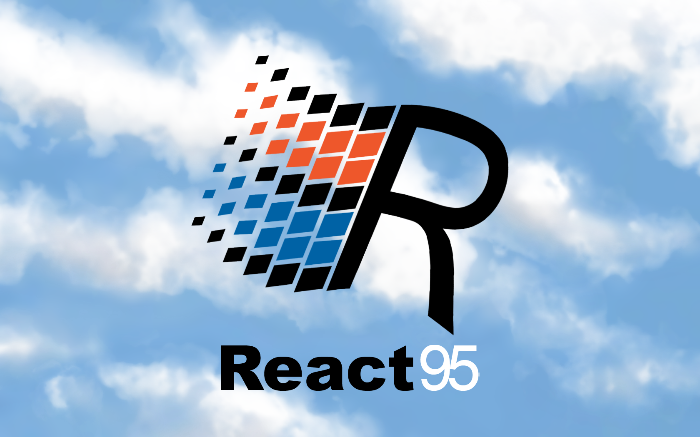

# React95

[](https://twitter.com/ReactAmsterdam/status/1116707269956251648)
[](#contributors)
[](https://travis-ci.org/React95/React95)
[](http://commitizen.github.io/cz-cli/)
[](https://github.com/styled-components/styled-components)
[](https://www.npmjs.com/package/@react95/core)

React95 is a component library inspired on the **Windows 95** UI design.

## Installation

React95 will be available via either npm and yarn.

```shell
npm install @react95/core
# or
yarn add @react95/core
```

_Warning:_ React95 isn't production ready yet, use it at your own risk!

## Usage

After installation, you can use any React95 component in your React application:

```js
import { Button } from '@react95/core';
// or
import Button from '@react95/core/Button';

// ...

render() {
  return (
    <div>
      <Button>Click me!</Button>
    </div>
  );
}
```

You can find a list of all available components at our [Storybook](https://react95.github.io/React95/)

## Roadmap

You can see what we have in mind to put on React95 at our [projects](https://github.com/React95/React95/projects) page.

## Development

If you'd like to help us out with the project, we welcome contributions of all types! Check out our [CONTRIBUTING.md](CONTRIBUTING.md) for more details on how you can help make React95 amazing!

## Contributors

Thanks goes to these wonderful people ([emoji key](https://github.com/kentcdodds/all-contributors#emoji-key)):

<!-- ALL-CONTRIBUTORS-LIST:START - Do not remove or modify this section -->
<!-- prettier-ignore -->
<table><tr><td align="center"><a href="https://allysson.me/"><br /><sub><b>Allysson dos Santos</b></sub></a><br /><a href="https://github.com/React95/React95/commits?author=allyssonsantos" title="Documentation">📖</a> <a href="https://github.com/React95/React95/commits?author=allyssonsantos" title="Code">💻</a> <a href="#ideas-allyssonsantos" title="Ideas, Planning, & Feedback">🤔</a> <a href="#review-allyssonsantos" title="Reviewed Pull Requests">👀</a></td><td align="center"><a href="https://github.com/ggdaltoso"><br /><sub><b>Gabriel Daltoso</b></sub></a><br /><a href="https://github.com/React95/React95/commits?author=ggdaltoso" title="Documentation">📖</a> <a href="https://github.com/React95/React95/commits?author=ggdaltoso" title="Code">💻</a> <a href="#ideas-ggdaltoso" title="Ideas, Planning, & Feedback">🤔</a> <a href="#review-ggdaltoso" title="Reviewed Pull Requests">👀</a></td><td align="center"><a href="https://github.com/gennymcdonagh"><br /><sub><b>Genny McDonagh</b></sub></a><br /><a href="https://github.com/React95/React95/commits?author=gennymcdonagh" title="Code">💻</a></td><td align="center"><a href="https://github.com/andreloureiro"><br /><sub><b>André Loureiro</b></sub></a><br /><a href="https://github.com/React95/React95/commits?author=andreloureiro" title="Code">💻</a></td></tr></table>

<!-- ALL-CONTRIBUTORS-LIST:END -->

This project follows the [all-contributors](https://github.com/kentcdodds/all-contributors) specification. Contributions of any kind welcome!
