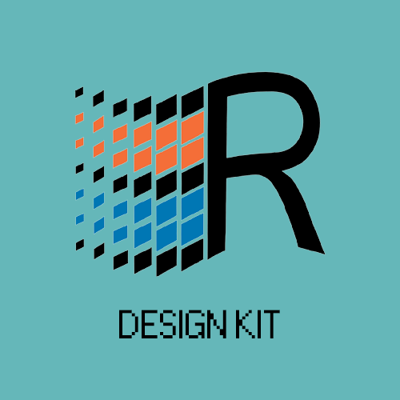

# React95 Design Kit

This is the Figma design kit present on Storybook alongside the components. This file is meant to correspond to [the design on the Figma website](https://www.figma.com/file/2cbigNitjcruBDZT12ixIq/React95-Design-Kit?node-id=0%3A1). Feel free to download this and play with it to create awesome designs!

## Contributing

Due to a bit of hazzle with Figma-addon, the best way to update contributions is through creating a pull request and these changes are added to the file which is online.

## Changelog

- 26/12/2020 Updated hover effect on buttons `:focus`-state
