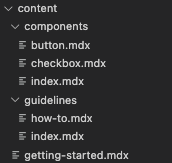
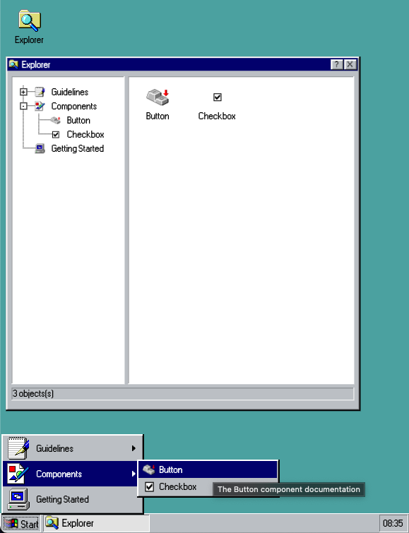

<p align="center">
  <a href="https://www.gatsbyjs.com">
    
  </a>
</p>

<h1 align="center">
  The React95 Gatsby theme
</h1>

## Installation

### For a new site

If you're creating a new site and want to use the React95 theme, you can use the [Gatsby CLI](https://www.gatsbyjs.com/docs/reference/gatsby-cli/#new) (make sure to select styled-components as your styling system)

```shell
gatsby new my-nostalgic-blog
```

Follow the CLI and when you've finished, go to the next step

### For an existing site

If you already have a site you'd like to add the React95 theme to, you can manually configure it.

1. Install the React95 theme

```
npm install @react95/core @react95/gatsby-theme styled-components

# or

yarn add @react95/core @react95/gatsby-theme styled-components
```

2. Add the configuration to your `gatsby-config.js` file

```js
// gatsby-config.js
module.exports = {
  plugins: [
    {
      resolve: `@react95/gatsby-theme`,
      options: {
        // basePath defaults to `/`
        basePath: `/site`,
      },
    },
  ],
};
```

3. Add content to your site by creating `md` or `mdx` files inside `/content` folder.

> React95 theme will create everything for you so you might not need `src/pages`.

> Note that if you've changed the default `contentPath` in the configuration, you'll want to add your markdown files in the directory specified by that path.

4. Run your site using `gatsby develop` and see your content in the TaskBar. If you used the above configuration, your URL will be `http://localhost:8000/site`

> If you have no content in the beginning, React95 theme will generate a starter for you.

## Usage

### Theme options

| Key           | Default value | Description              |
| ------------- | ------------- | ------------------------ |
| `basePath`    | `/`           | Root url for all content |
| `contentPath` | `content`     | Location of your content |

### Additional configuration

In addition to the theme options, there are a handful of items you can customize via the `siteMetadata` object in your site's `gatsby-config.js`

```js
// gatsby-config.js
module.exports = {
  siteMetadata: {
    // Used for the site title and SEO
    title: `Gatsby - Powered By React95`,
    // Used for SEO
    description: `This is a Gatsby website that uses React95`,
    // Used for resolving images in social cards
    siteUrl: `https://example.com`,
    // Used for SEO in social cards
    image: `/path-to/your/image`,
    // Used for SEO
    author: `@mynickname`,
  },
};
```

### Content Fields

The following are the defined content fields based on the node interface in the schema

| Field       | Type   |
| ----------- | ------ |
| title       | String |
| image       | String |
| description | String |
| icon        | Icon   |
| image       | String |

Icon type

| Field   | Type   |
| ------- | ------ |
| name    | String |
| variant | String |

```md
# content/getting-started.mdx

---

title: Getting Started
description: Your awesome and nostalgic website!
icon:
  name: Computer
  variant: 32x32_4

---

# Your website starts on this folder

Feel free to add your content!
```

### Image Behavior

Content can include references to images from static folder inside frontmatter.

```md
---
title: Hello World (example)
image: /some-image.jpg
icon:
  name: Computer
  variant: 32x32_4
---
```

When adding an `image` it will be the featured image within the post.

### How Styles work

Inside any `mdx` file you have all React95 components at your service:

```md
---
title: How to
icon:
  name: FolderExe
  variant: 16x16_4
---

<Frame
  bg="white"
  p={6}
  boxShadow="in"
  height="100%"
>

# How to

...

</Frame>
```

## Examples

| File structure                                        | Desktop View                                    |
| ----------------------------------------------------- | ----------------------------------------------- |
|  |  |
